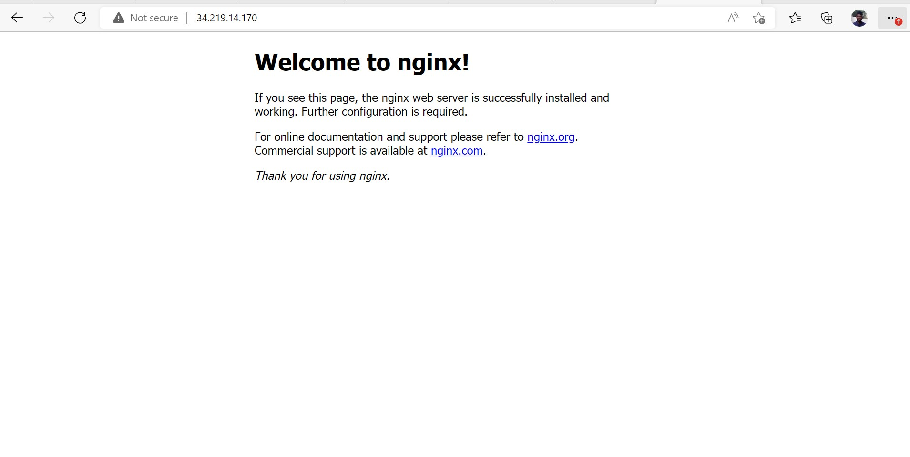
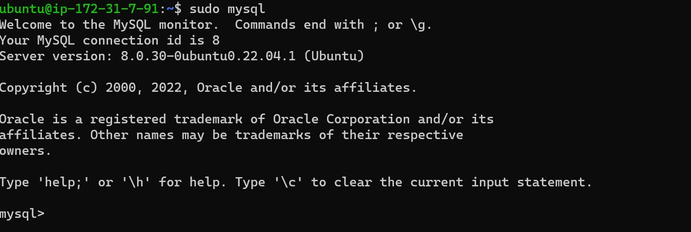
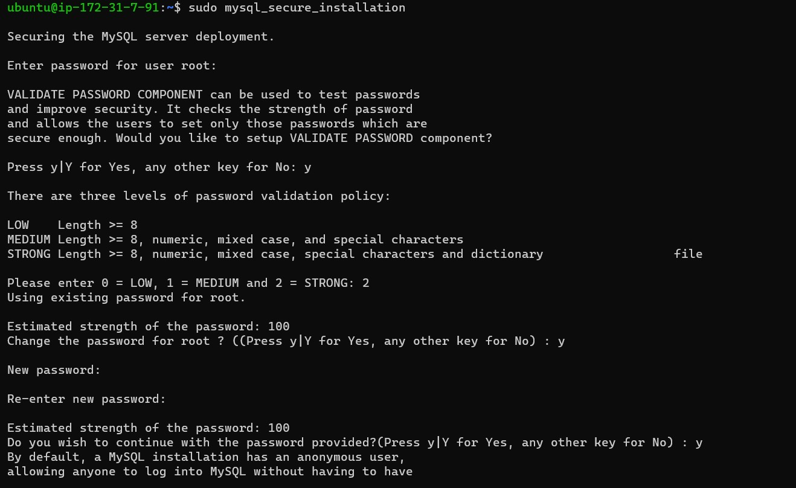
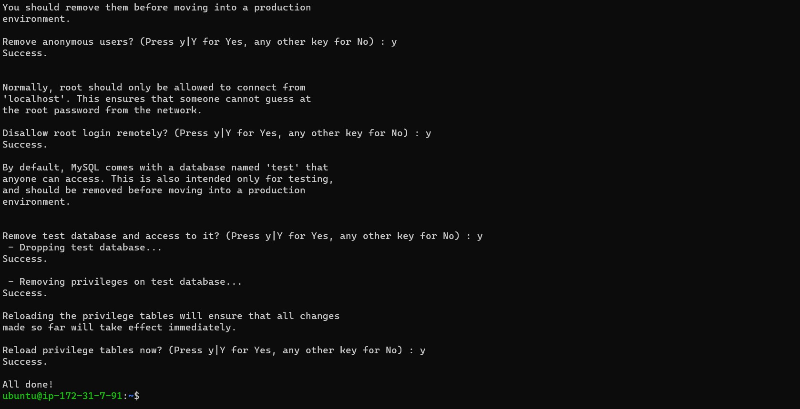
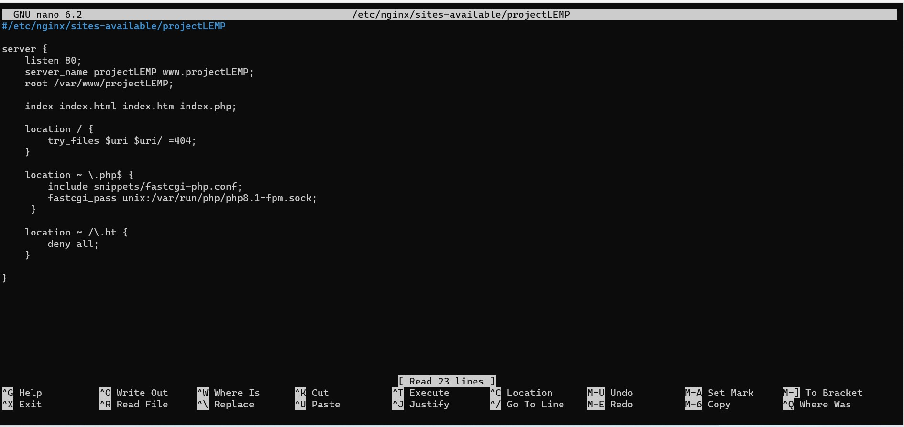
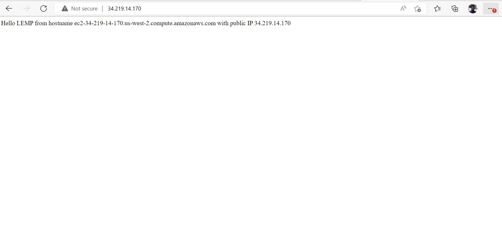
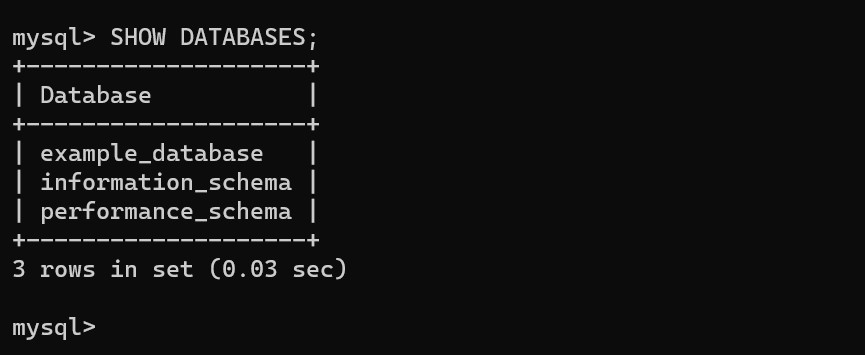
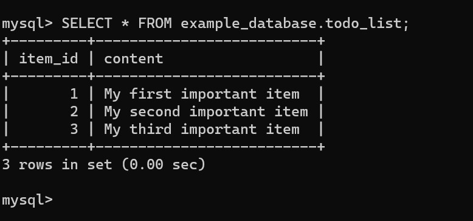
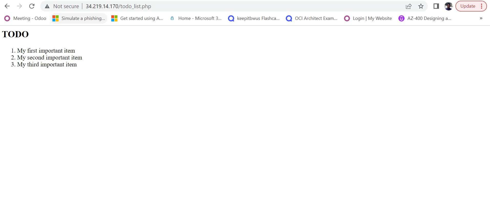

# Documentation for Project 2 (LEMP Stack)
## Step 1 (Installing nginx)

**Update and Install Nginx using Ubuntu’s package manager**

Enter the following commands

- `sudo apt update` 
- `sudo apt install nginx`

To verify that **nginx** was successfully installed and is running as a service in Ubuntu, run:

- `sudo systemctl status nginx`
  
If it is green and running, then you did everything correctly – you have just launched your first Web Server in the Clouds and below is the picture to show

Before we can receive any traffic by our Web Server, we need to open TCP port 80 which is default port that web brousers use to access web pages in the Internet. To prove that accessibility to the Ubuntu Webserver, enter the following URL on a browser

- `curl http://localhost:80`
- or
- `curl http://127.0.0.1:80`

To test how our **Nginx** server can respond to requests from the Internet.
Open a web browser of your choice and try to access following url
- `http://34.219.14.170:80` 

 and the result is shown below 
 

(Another way to get your ip from the server on AWS is by running the command below)  
-`curl -s http://169.254.169.254/latest/meta-data/public-ipv4`

## Step 2 (Installing MySQL)

**Use ‘apt’ to acquire and install MySQL software:**

- `$ sudo apt install mysql-server`

When prompted, confirm installation by typing **Y**, and then ENTER.
When the installation is finished, log in to the MySQL console by typing:

- `$ sudo mysql`

This will connect to the MySQL server as the administrative database user root, which is inferred by the use of sudo when running this command. You should see output like this

Now set a password for the root user, using **mysql_native_password** as default authentication method. We’re defining this user’s password as **PassWord.1**

- `ALTER USER 'root'@'localhost' IDENTIFIED WITH mysql_native_password BY 'PassWord.1';`

Exit the MySQL shell with:
- `exit`

Start the interactive script by running:
- `sudo mysql_secure_installation`

This will ask if you want to configure the **VALIDATE PASSWORD PLUGIN.**

Answer Y for yes, or anything else to continue without enabling

If you answer “yes”, you’ll be asked to select a level of password validation. Keep in mind that if you enter 2 for the strongest level, you will receive errors when attempting to set any password which does not contain numbers, upper and lowercase letters, and special characters, or which is based on common dictionary words e.g PassWord.1.

For the rest of the questions, press Y and hit the ENTER key at each prompt. This will prompt you to change the root password, remove some anonymous users and the test database, disable remote root logins, and load these new rules so that MySQL immediately respects the changes you have made.

When you’re finished, test if you’re able to log in to the MySQL console by typing:

- `sudo mysql -p`

Notice the -p flag in this command, which will prompt you for the password used after changing the root user password.

To exit the MySQL console, type:
- `exit`

Notice that you need to provide a password to connect as the root user.
For increased security, it’s best to have dedicated user accounts with less expansive privileges set up for every database, especially if you plan on having multiple databases hosted on your server.

**Note: At the time of this writing, the native MySQL PHP library mysqlnd doesn’t support caching_sha2_authentication, the default authentication method for MySQL 8. For that reason, when creating database users for PHP applications on MySQL 8, you’ll need to make sure they’re configured to use mysql_native_password instead. We’ll demonstrate how to do that in Step 6.**

Your MySQL server is now installed and secured. 

Next, we will install PHP, the final component in the LEMP stack.

## Step 3 (Installing PHP)

**Having installed Nginx to serve your content and MySQL installed to store and manage your data. Now you can install PHP to process code and generate dynamic content for the web server.
While Apache embeds the PHP interpreter in each request, Nginx requires an external program to handle PHP processing and act as a bridge between the PHP interpreter itself and the web server. This allows for a better overall performance in most PHP-based websites, but it requires additional configuration. You’ll need to install php-fpm, which stands for “PHP fastCGI process manager”, and tell Nginx to pass PHP requests to this software for processing. Additionally, you’ll need php-mysql, a PHP module that allows PHP to communicate with MySQL-based databases. Core PHP packages will automatically be installed as dependencies.**

- `sudo apt install php-fpm php-mysql`

When prompted, type **Y** and press **ENTER** to confirm installation.

You now have your PHP components installed. Next, you will configure Nginx to use them.

## Step 4 (CONFIGURING NGINX TO USE PHP PROCESSOR)

*When using the Nginx web server, we can create server blocks (similar to virtual hosts in Apache) to encapsulate configuration details and host more than one domain on a single server. In this guide, we will use projectLEMP as an example domain name.*

*On Ubuntu 20.04, Nginx has one server block enabled by default and is configured to serve documents out of a directory at /var/www/html. While this works well for a single site, it can become difficult to manage if you are hosting multiple sites. Instead of modifying /var/www/html, we’ll create a directory structure within /var/www for the your_domain website, leaving /var/www/html in place as the default directory to be served if a client request does not match any other sites.*

Create the root web directory for your_domain as follows:
- `sudo mkdir /var/www/projectLEMP`

Next, assign ownership of the directory with the $USER environment variable, which will reference your current system user:
- `sudo chown -R $USER:$USER /var/www/projectLEMP`
  
Then, open a new configuration file in Nginx’s sites-available directory using your preferred command-line editor. Here, we’ll use **nano**:
- `sudo nano /etc/nginx/sites-available/projectLEMP`

Enter the text below and see the outcome

#/etc/nginx/sites-available/projectLEMP

server {
    
    listen 80;
    server_name projectLEMP www.projectLEMP;
    root /var/www/projectLEMP;

    index index.html index.htm index.php;

    location / {
        try_files $uri $uri/ =404;
    }

    location ~ \.php$ {
        include snippets/fastcgi-php.conf;
        fastcgi_pass unix:/var/run/php/php8.1-fpm.sock;
     }

    location ~ /\.ht {
        deny all;
    }

}

**Here’s what each of these directives and location blocks do:**

**listen — Defines what port Nginx will listen on. In this case, it will listen on port 80, the default port for HTTP.*

**root — Defines the document root where the files served by this website are stored.*

**index — Defines in which order Nginx will prioritize index files for this website. It is a common practice to list index.html files with a higher precedence than index.php files to allow for quickly setting up a maintenance landing page in PHP applications. You can adjust these settings to better suit your application needs.*

**server_name — Defines which domain names and/or IP addresses this server block should respond for. Point this directive to your server’s domain name or public IP address.*

**location / — The first location block includes a try_files directive, which checks for the existence of files or directories matching a URI request. If Nginx cannot find the appropriate resource, it will return a 404 error.*

**location ~ \.php$ — This location block handles the actual PHP processing by pointing Nginx to the fastcgi-php.conf configuration file and the php7.4-fpm.sock file, which declares what socket is associated with php-fpm.*

**location ~ /\.ht — The last location block deals with .htaccess files, which Nginx does not process. By adding the deny all directive, if any .htaccess files happen to find their way into the document root ,they will not be served to visitors.*

**When you’re done editing, save and close the file. If you’re using nano, you can do so by typing CTRL+X and then y and ENTER to confirm.**

*Activate your configuration by linking to the config file from Nginx’s sites-enabled directory*

- `sudo ln -s /etc/nginx/sites-available/projectLEMP /etc/nginx/sites-enabled/`

This will tell Nginx to use the configuration next time it is reloaded. You can test your configuration for syntax errors by typing:
- `sudo nginx -t`

*You should get a Successful confirmation If any errors are reported, go back to your configuration file to review its contents before continuing.*

We also need to disable default Nginx host that is currently configured to listen on port 80, for this run:
- `sudo unlink /etc/nginx/sites-enabled/default`

When you are ready, reload Nginx to apply the changes:
- `sudo systemctl reload nginx`

Your new website is now active, but the web root /var/www/projectLEMP is still empty. Create an index.html file in that location so that we can test that your new server block works as expected:

Now go to your browser and try to open your website URL using IP address:
- `http://34.219.14.170:80`
  
Below is how it show appear on your browser 

Your LEMP stack is now fully configured. In the next step, we’ll create a PHP script to test that Nginx is in fact able to handle .php files within your newly configured website.

## Step 5 (TESTING PHP WITH NGINX)

Your LEMP stack should now be completely set up.

At this point, your LAMP stack is completely installed and fully operational.
You can test it to validate that Nginx can correctly hand .php files off to your PHP processor.
You can do this by creating a test PHP file in your document root. 

Open a new file called info.php within your document root in your text editor:

- `sudo nano /var/www/projectLEMP/info.php`

Type or paste the following lines into the new file. This is valid PHP code that will return information about your server:

'      

       <? php 
       phpinfo();

You can now access this page in your web browser by visiting the domain name or public IP address you’ve set up in your Nginx configuration file, followed by /info.php:

- http://34.219.14.170/info.php

After checking the relevant information about your PHP server through that page, it’s best to remove the file you created as it contains sensitive information about your PHP environment and your Ubuntu server. You can use rm to remove that file:

`sudo rm /var/www/your_domain/info.php`

## Step 6 (RETRIEVING DATA FROM MYSQL DATABASE WITH PHP)

*In this step you will create a test database (DB) with simple "To do list" and configure access to it, so the Nginx website would be able to query data from the DB and display it.*

*At the time of this writing, the native MySQL PHP library mysqlnd doesn’t support caching_sha2_authentication, the default authentication method for MySQL 8. We’ll need to create a new user with the mysql_native_password authentication method in order to be able to connect to the MySQL database from PHP.*

We will create a database named example_database and a user named example_user, but you can replace these names with different values.

First, connect to the MySQL console using the root account:
- `sudo mysql`
  

-  create database  `example_database`;

Now you can create a new user and grant him full privileges on the database you have just created.

The following command creates a new user named example_user, using mysql_native_password as default authentication method. We’re defining this user’s password as password, but you should replace this value with a secure password of your own choosing.

- `  CREATE USER 'example_user'@'%' IDENTIFIED WITH mysql_native_password BY 'password';`

Now we need to give this user permission over the example_database database

`GRANT ALL ON example_database.* TO 'example_user'@'%';`

This will give the example_user user full privileges over the example_database database, while preventing this user from creating or modifying other databases on your server.

Now exit the MySQL shell with

`exit`

You can test if the new user has the proper permissions by logging in to the MySQL console again, this time using the custom user credentials. Below is the result

)

Next, we’ll create a test table named todo_list. From the MySQL console, run the following statement:

CREATE TABLE example_database.todo_list (
    item_id INT AUTO_INCREMENT,content VARCHAR(255),PRIMARY KEY(item_id));

Insert a few rows of content in the test table. You might want to repeat the next command a few times, using different VALUES:

To confirm that the data was successfully saved to your table, run:

`SELECT * FROM example_database.todo_list;`

and below is the result 

After confirming that you have valid data in your test table, you can exit the MySQL console

`exit`

Now you can create a PHP script that will connect to MySQL and query for your content. Create a new PHP file in your custom web root directory using your nano editor.

`nano /var/www/projectLEMP/todo_list.php`

The following PHP script connects to the MySQL database and queries for the content of the todo_list table, displays the results in a list. If there is a problem with the database connection, it will throw an exception.

Copy this content into your todo_list.php script:

`<?php
$user = "example_user";
$password = "password";
$database = "example_database";
$table = "todo_list";

try {
  $db = new PDO("mysql:host=localhost;dbname=$database", $user, $password);
  echo "<h2>TODO</h2><ol>";
  foreach($db->query("SELECT content FROM $table") as $row) {
    echo "<li>" . $row['content'] . "</li>";
  }
  echo "</ol>";
} catch (PDOException $e) {
    print "Error!: " . $e->getMessage() . " ";
    die();
}`

Save and close the file when you are done editing.

You can now access this page in your web browser by visiting the domain name or public IP address configured for your website, followed by /todo_list.php:

http://34.219.14.170/info.php

That means your PHP environment is ready to connect and interact with your MySQL server.